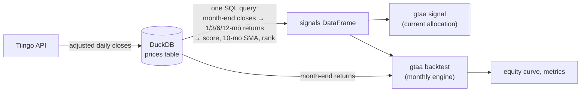

# GTAA AGG 6 / AGG 3

Current signals and a monthly backtest for Meb Faber's *aggressive* Global
Tactical Asset Allocation (the top-6 and top-3 versions of GTAA 13), using
plain ETFs, a DuckDB file, and under 600 lines of Python.

```
$ gtaa signal --top 6

GTAA AGG 6, decided at 2026-08-31 (complete)

rank  symbol asset class                     score  vs 10mo SMA   weight
   1  DBC    Commodities                    20.69%  above          16.7%
   2  VTV    US large-cap value             10.95%  above          16.7%
   3  MTUM   US large-cap momentum           9.64%  above          16.7%
   4  VEA    Foreign developed equities      9.43%  above          16.7%
   5  VBR    US small-cap value              8.20%  above          16.7%
   6  VB     US small-cap                    8.09%  above          16.7%
      BIL    Cash (90-day T-bills)                                  0.0%
```

The aim is fidelity to the published rules, not improvement on them. Every
deliberate departure from the paper is listed under [Deviations](#deviations-from-the-paper).

## The strategy

Faber introduced the tactical asset allocation model in [*A Quantitative
Approach to Tactical Asset Allocation*](https://mebfaber.com/wp-content/uploads/2016/05/SSRN-id962461.pdf)
(2007; updated 2013), and the relative-strength extension in [*Relative
Strength Strategies for Investing*](https://papers.ssrn.com/sol3/papers.cfm?abstract_id=1585517)
(2010). The aggressive variant combines the two. In the 2013 paper's words:

> This portfolio begins with the asset classes listed in the GTAA Moderate
> allocation. It then selects the top six out of the thirteen assets as
> ranked by an average of 1, 3, 6, and 12-month total returns (momentum) …
> The assets are only included if they are above their long-term moving
> average, otherwise that portion of the portfolio is moved to cash. We also
> include the effects of only investing in the top three out of thirteen
> assets.

The rules, as implemented here:

1. **Once a month, on the last trading day**, compute for each of the 13
   asset classes its 1-, 3-, 6- and 12-month total returns (from month-end
   closes), and average the four. That average is the asset's **score**.
2. **Rank** the 13 by score. The top 6 (AGG 6) or top 3 (AGG 3) are the
   candidates.
3. **Trend filter:** a candidate is held only if its month-end close is
   above its **10-month simple moving average** of month-end closes.
   A candidate below its average is *not* replaced by the next-ranked asset;
   **that slot goes to cash**.
4. **Weights:** each held asset gets 1/6 (or 1/3) of the portfolio; the rest
   is cash. Hold for one month, then repeat. The portfolio is rebalanced to
   the target weights every month.

Faber's other assumptions are kept: all series are total returns (dividends
reinvested), cash earns the 90-day T-bill return, and the backtest ignores
taxes, commissions and slippage.

## The 13 asset classes and their ETF proxies

Faber's tables are built from long-history indexes (S&P 500, MSCI EAFE,
GSCI, NAREIT, and so on). To hold the strategy, and to backtest it on
prices you can actually trade, each asset class needs an ETF. The choices below favour
**low cost, liquidity, and the longest available history**, in that order.
`gtaa/universe.py` is the single source of truth.

| # | Asset class | ETF | Why this one | History from |
|---|---|---|---|---|
| 1 | US large-cap value | **VTV** | Vanguard's CRSP large value fund; cheapest and largest in its category. | 2004-02 |
| 2 | US large-cap momentum | **MTUM** | The only broad, liquid US momentum-factor ETF with more than a decade of history. It is what limits the backtest start date. | 2013-05 |
| 3 | US small-cap value | **VBR** | Companion to VTV in the small-cap value corner. | 2004-02 |
| 4 | US small-cap | **VB** | Faber's fourth equity sleeve is small-cap *momentum*, for which no cheap, long-lived ETF exists. Plain small caps stand in; see Deviations. | 2004-02 |
| 5 | Foreign developed equities | **VEA** | Broad developed ex-US at 0.03–0.05%; the paper uses MSCI EAFE. VEA also holds Canada, EAFE does not. | 2007-08 |
| 6 | Emerging-market equities | **VWO** | Broad EM, lowest cost. | 2005-04 |
| 7 | US intermediate Treasuries | **IEF** | 7–10 year Treasuries, the closest fund to the paper's 10-year government bond series. | 2002-08 |
| 8 | US long-term Treasuries | **TLT** | 20+ year Treasuries for the paper's 30-year bond series. | 2002-08 |
| 9 | Foreign government bonds | **BWX** | International (ex-US) developed-market sovereigns, unhedged, as in the paper's foreign 10-year bond series. The only long-lived ETF in this niche. | 2007-11 |
| 10 | US corporate bonds | **LQD** | Investment-grade corporates; the paper uses a corporate bond index. | 2002-08 |
| 11 | Commodities | **DBC** | Broad, diversified commodity futures. The paper uses the GSCI; the closest fund (GSG) is energy-heavy and thinly traded, so DBC's diversified basket is used. | 2006-03 |
| 12 | Gold | **GLD** | The original and largest physically-backed gold fund. IAU is cheaper but younger; either works. | 2004-12 |
| 13 | Real estate | **VNQ** | Broad US REITs, the paper's NAREIT series. | 2004-10 |
| | Cash | **BIL** | 1–3 month T-bills, the paper's 90-day T-bill cash return. Nothing else in the universe has any bearing on it. | 2007-06 |

Adjusted closes (dividends and splits) from Tiingo make each series a
total-return series, matching the paper's data.

One practical note on DBC: it is structured as a partnership and issues a
Schedule K-1 at tax time, which some investors prefer to avoid. Invesco's
**PDBC** tracks a near-identical basket without the K-1 (it is younger,
launched November 2014). Swapping it in changes almost nothing: the two
funds' momentum ranks and trend status differed in one month out of 129,
and over PDBC's own history (December 2015 to August 2026) AGG 6 returns
9.61% a year with DBC and 9.68% with PDBC; for AGG 3 it is 8.30% and 8.28%.
DBC is kept as the default only because its history reaches back to 2006.

### How far back the backtest goes

Every asset needs twelve month-ends of history before it has a score, and
the backtest refuses to rank an incomplete universe. MTUM is the youngest
fund (April 2013), so the first decision is made at the end of **April 2014**
and the first realised month is May 2014. Everything else in the universe
has history to 2004–2007.

That is a shorter sample than Faber's 1973–2012 index study, and it is a
deliberate trade: the main backtest covers the portfolio you can actually
buy, on the prices it actually had, with no splicing or approximation.

For a longer view, see the [extended backtest](#extended-backtest-2000-to-present)
below, which goes back to 2000 with proxies.

## Results

`gtaa backtest --top 6 --years` on data through August 2026:

```
GTAA AGG 6: 2014-04 to 2026-08 (148 months, month-end to month-end)

Strategy (top 6 by momentum, trend filter, rest in cash)
  CAGR                      8.31%
  Max drawdown            -12.33%
  Volatility (annual)       9.22%
  Sharpe (vs T-bills)        0.72
  Best month                8.17%
  Worst month              -7.09%
  Average cash weight       10.8%

Equal-weight (all 13 held at once, 1/13 each, rebalanced monthly)
  CAGR                      6.93%
  Max drawdown            -19.68%
  Volatility (annual)       9.98%
  Sharpe (vs T-bills)        0.54
  Best month                7.83%
  Worst month             -10.97%

Calendar years:
         strategy   equal-weight
  2014      8.57%          1.52%  (from May)
  2015     -8.11%         -4.48%
  2016      7.47%          9.97%
  2017     18.84%         14.50%
  2018     -1.72%         -6.08%
  2019      8.03%         19.58%
  2020     11.92%         12.01%
  2021     22.13%         11.47%
  2022     -6.95%        -13.38%
  2023     -0.71%          9.46%
  2024     11.51%          8.27%
  2025     20.57%         16.33%
  2026     16.51%         11.81%  (to Aug)
```

```
GTAA AGG 3: 2014-04 to 2026-08 (148 months, month-end to month-end)

Strategy (top 3 by momentum, trend filter, rest in cash)
  CAGR                      7.11%
  Max drawdown            -15.20%
  Volatility (annual)      11.06%
  Sharpe (vs T-bills)        0.51
  Best month                7.76%
  Worst month              -8.88%
  Average cash weight        5.9%

Equal-weight (all 13 held at once, 1/13 each, rebalanced monthly)
  CAGR                      6.93%
  Max drawdown            -19.68%
  Volatility (annual)       9.98%
  Sharpe (vs T-bills)        0.54
  Best month                7.83%
  Worst month             -10.97%
```

"Equal-weight" means holding all 13 ETFs at the same time, 1/13 in each,
rebalanced back to that every month: the same universe with no ranking,
no trend filter and never any cash. It is the honest benchmark for the
rules, not a stock index, because the only difference between the two
tables is the rules.

Twelve years is a short sample, most of it a bull market in US equities
with one sharp drawdown (2020) and one bear market in both stocks and bonds
(2022). Treat the numbers as a description of the rules' behaviour over
this period, not a forecast. There are no transaction costs, and a monthly
rebalanced 6-asset portfolio does trade: expect real-world returns somewhat
lower.

### Rolling periods

The full-period CAGR hides how different the experience was depending on
when you started. `gtaa backtest --top 6 --rolling` looks at every 1-,
3- and 5-year window of consecutive months and reports the best and worst
(annualised, with the months they cover), the median, and how many windows
were positive:

```
Rolling returns (annualised, every window of consecutive months):
Strategy
  window       best  (period)               worst  (period)              median  positive
  1 year     39.03%  2020-11 to 2021-10   -10.89%  2015-02 to 2016-01     6.36%   70% of 137
  3 years    16.77%  2023-07 to 2026-06     0.88%  2021-05 to 2024-04     7.87%  100% of 113
  5 years    12.28%  2016-11 to 2021-10     3.21%  2015-04 to 2020-03     7.55%  100% of 89
Equal-weight
  window       best  (period)               worst  (period)              median  positive
  1 year     33.39%  2020-04 to 2021-03   -16.52%  2021-10 to 2022-09     7.64%   77% of 137
  3 years    15.07%  2023-06 to 2026-05     0.15%  2021-05 to 2024-04     6.22%  100% of 113
  5 years    10.10%  2016-03 to 2021-02     2.53%  2015-04 to 2020-03     6.22%  100% of 89
```

AGG 3 (the equal-weight rows are the same as above):

```
Rolling returns (annualised, every window of consecutive months):
Strategy
  window       best  (period)               worst  (period)              median  positive
  1 year     36.21%  2020-07 to 2021-06   -15.00%  2015-02 to 2016-01     5.85%   67% of 137
  3 years    18.25%  2019-06 to 2022-05    -0.54%  2022-05 to 2025-04     5.71%   96% of 113
  5 years    11.73%  2017-04 to 2022-03     0.47%  2015-02 to 2020-01     7.87%  100% of 89
```

### Underwater

"Underwater" means below a previous high: the months an investor spent
waiting to get back to even. `gtaa backtest --top 6 --underwater` reports
the share of months spent underwater, the longest stretch from a high to
its recovery, the current position, and the five deepest drawdowns with
how long each took to reach bottom and then to recover:

```
Underwater (months spent below the previous equity high):
Strategy
  Time underwater             70% of months
  Longest stretch              32 months (2021-12 to 2024-08)
  Now                      -0.47% below the high
  Largest drawdowns:
    peak     trough   recovered     depth  to trough  to recover
    2021-12  2023-09  2024-08     -12.33%      21 mo       11 mo
    2015-01  2016-01  2017-02     -10.89%      12 mo       13 mo
    2018-08  2019-05  2020-08      -9.85%       9 mo       15 mo
    2024-11  2024-12  2025-06      -5.92%       1 mo        6 mo
    2018-01  2018-04  2018-08      -4.27%       3 mo        4 mo
Equal-weight
  Time underwater             63% of months
  Longest stretch              31 months (2021-12 to 2024-07)
  Now                       0.00% below the high
  Largest drawdowns:
    peak     trough   recovered     depth  to trough  to recover
    2021-12  2022-09  2024-07     -19.68%       9 mo       22 mo
    2019-12  2020-03  2020-07     -14.52%       3 mo        4 mo
    2014-08  2016-01  2016-06      -9.02%      17 mo        5 mo
    2018-01  2018-12  2019-03      -8.13%      11 mo        3 mo
    2024-11  2024-12  2025-05      -4.08%       1 mo        5 mo
```

AGG 3:

```
Underwater (months spent below the previous equity high):
Strategy
  Time underwater             76% of months
  Longest stretch              32 months (2015-01 to 2017-09)
  Now                      -3.97% below the high
  Largest drawdowns:
    peak     trough   recovered     depth  to trough  to recover
    2022-05  2023-10  2024-11     -15.20%      17 mo       13 mo
    2018-08  2019-05  2020-08     -15.06%       9 mo       15 mo
    2015-01  2016-01  2017-09     -15.00%      12 mo       20 mo
    2026-02  2026-03  -            -8.88%       1 mo           -
    2024-11  2024-12  2025-06      -6.45%       1 mo        6 mo
```

Two things stand out. Neither AGG 6 nor equal-weight has a losing 3- or
5-year window in this sample (AGG 3 has one, barely: -0.54% a year over
2022–25), so the sample simply does not contain a long bad stretch for a
diversified portfolio; the extended backtest does. And the strategy spends *more* time underwater than
equal-weight (70% of months against 63%) despite shallower drawdowns: it
gives up ground slowly in choppy markets (2015, 2018, 2023) and takes a
year or more to climb back, while equal-weight's drawdowns are sharper but
recover with the market.

## Extended backtest (2000 to present)

The [`extended/`](extended/) directory runs the same engine from
**August 2000**, through the 2000–02 and 2008 bear markets, by splicing a
mutual fund in front of each ETF for the years before the ETF existed. Its
[README](extended/README.md) lists every proxy fund, the date it hands over
to the ETF, and why it was chosen.

**Those results should be seen as less reliable than the 2014 ones.** For
most sleeves the proxy is the same Vanguard fund in an older share class,
but three have no faithful substitute: momentum is the plain S&P 500 before
2013, gold is a gold-mining stock fund before 2004, and commodities are a
GSCI-tracking fund before 2006. The proxies also carried higher fees than
today's ETFs. Over 2000–2026 AGG 6 shows a CAGR of 10.23% with a maximum
drawdown of 12.78%, against 7.76% and 34.47% for equal-weight; a large
part of the difference is 2008 alone (-1.7% against -20.5%). Read the caveats in that README
before quoting the numbers.

## How it works



The whole strategy is one SQL query (`gtaa/signals.py`) over a single
table:

```
prices(symbol, date, close, adj_close)
```

DuckDB window functions do all the work: `row_number()` picks the last
trading day of each month, `lag()` gives the returns over 1/3/6/12 months,
`avg() OVER (… ROWS 9 PRECEDING)` is the 10-month average, and
`row_number() OVER (PARTITION BY month ORDER BY score DESC)` is the ranking.
Two guards keep it honest: a lookback is only used if the lagged row really
is that many months earlier (a gap in the data would otherwise mislabel a
return), and a symbol only gets a row once it has a full 12 months of
history.

Python then does the parts that are awkward in SQL: applying the
top-N-then-filter rule, assigning weights, and running the backtest, which
is a month-by-month loop in `gtaa/backtest.py` that multiplies the weights
decided at month *m* by the returns realised in month *m + 1*. Nothing in
the engine can see a price later than the decision date.

Files:

| | |
|---|---|
| `gtaa/universe.py` | the 13 asset classes, ETFs, lookbacks, SMA length |
| `gtaa/data.py` | Tiingo client and the DuckDB `prices` table |
| `gtaa/signals.py` | the SQL query, selection rule, current allocation |
| `gtaa/backtest.py` | the monthly engine and its benchmark |
| `gtaa/metrics.py` | CAGR, volatility, Sharpe, calendar years, rolling windows, drawdown episodes |
| `gtaa/cli.py` | the `gtaa` command |
| `tests/` | the rules and the engine, checked on hand-built price paths |
| `extended/` | the 2000–present backtest on spliced mutual-fund history, with its own README |

## Usage

Requires Python 3.11+ and a free [Tiingo](https://www.tiingo.com) API key.

```bash
git clone https://github.com/patrickspencer/gtaa
cd gtaa
python -m venv .venv && source .venv/bin/activate
pip install -e ".[dev]"

export TIINGO_API_KEY=...       # from your Tiingo account
gtaa update                     # fetch full history for all 14 ETFs (~30 s)
gtaa signal --top 6             # this month's allocation
gtaa signal --top 3 --all       # AGG 3, with the full ranking
gtaa backtest --top 6 --years   # backtest with calendar-year table
gtaa backtest --top 6 --rolling --underwater   # rolling windows, drawdowns
gtaa backtest --top 6 --csv equity.csv
gtaa coverage                   # what history is stored
pytest                          # 22 tests, no network
```

The database is `gtaa.duckdb` in the working directory (override with
`--db` or `GTAA_DB`). `gtaa update` re-downloads each fund's full history
every time, on purpose: adjusted closes change retroactively whenever a
dividend is paid, and a total-return series is only consistent if all of it
comes from the same adjustment.

`gtaa signal` reports the decision from the latest **complete** month. Run
it before the month is over and it says so ("provisional"); the numbers then
show what the signal would be if today were month-end.

## Deviations from the paper

Faber's studies use index data; this uses ETFs. Beyond that, the places
where a choice had to be made:

- **Small-cap momentum → small-cap blend (VB).** Faber's fourth US equity
  sleeve is small-cap momentum. There is no low-cost, long-history ETF for
  it, and a small-cap growth fund is not the same factor. Broad small caps
  are the neutral substitute.
- **Commodities → DBC, not the GSCI.** GSG tracks the paper's index but is
  ~60% energy and thinly traded; DBC is a broader basket. This changes the
  commodity sleeve's behaviour somewhat, especially in 2008 and 2022.
- **Cash slots stay cash.** When a top-6 asset fails its trend filter, its
  1/6 stays in T-bills rather than being handed to the 7th-ranked asset.
  This follows the paper's wording ("that portion of the portfolio is moved
  to cash") and matches published implementations; the alternative
  interpretation would hold more equities in most months.
- **Ties** in score are broken alphabetically by symbol, which in practice
  never matters at four decimal places.
- **Backtest starts in 2014**, for the reason given above; `extended/`
  goes back to 2000 with proxies and is documented separately.

## Tests

`tests/` uses synthetic price paths whose correct answers can be worked out
by hand: a series that doubles every month (so each k-month return is
2ᵏ − 1), assets that collapse below their average, top-N with a trending
asset left out, a gap in history, a partial trailing month, a backtest
whose every monthly return is known in advance, rolling windows and
drawdown episodes on short hand-built series, and the fund-to-ETF splice
used by `extended/`. None of them touch the network.

## References

- Faber, M. *A Quantitative Approach to Tactical Asset Allocation.*
  Journal of Wealth Management, 2007; updated 2013.
  https://mebfaber.com/wp-content/uploads/2016/05/SSRN-id962461.pdf
- Faber, M. *Relative Strength Strategies for Investing.* 2010.
  https://papers.ssrn.com/sol3/papers.cfm?abstract_id=1585517
- Faber, M. and Richardson, E. *The Ivy Portfolio.* Wiley, 2009.

## License

MIT. This is a research tool, not investment advice.
